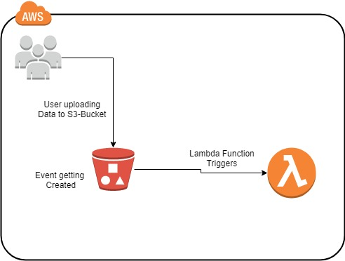

## Execute Lambda Functions on S3 Event Triggers

Amazon S3 service is used for file storage, where you can upload or remove files. 
We can trigger AWS Lambda on S3 when there are any file uploads in S3 buckets.
AWS Lambda has a handler function which acts as a start point for AWS Lambda function. 
The handler has the details of the events.
let us see how to use AWS S3 to trigger AWS Lambda function when we upload files in S3 bucket.

## Steps for Using AWS Lambda Function with Amazon S3
To start using AWS Lambda with Amazon S3, we need the following −

* Create S3 Bucket
* Create role which has permission to work with s3 and lambda
* Create lambda function and add s3 as the trigger.

